> [!NOTE]
> Página no Internet Archive
> 
> https://archive.org/details/ba_summer_rush

# Baixar

Baixe o zip [desse link](https://archive.org/compress/ba_summer_rush/formats=UNKNOWN,ARCHIVE%20BITTORRENT,METADATA,HTML) e extraia

Agora os passos se dividem, dependendo do sistema

---

# PC

> [!IMPORTANT]
> Antes de prosseguir, mude o idioma de conteúdo dos sites no navegador pra `Inglês (Estados Unidos)` em primeiro na lista
> - [Chrome](https://support.google.com/chrome/answer/173424?hl=pt-BR&co=GENIE.Platform%3DDesktop#zippy=*dicionar-idiomas-preferidos%2Cadicionar-idiomas-preferidos) (procure por `Adicionar idiomas preferidos`)
> - Firefox:
>   1. Abra as `Configurações`
>   2. Abra a página `Geral` (provavelmente já está aberta)
>   3. Procure `Idioma e aparência`
>   4. Um pouco abaixo, procure por `Idioma`
>   5. Ao lado de `Escolha o idioma preferido para exibir páginas`, clique no botão `Selecionar...`

1. Baixe o [Simple Web Server](https://simplewebserver.org/download.html)

2. 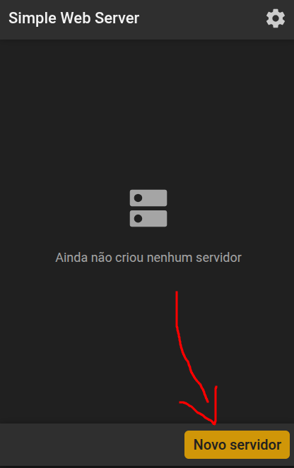

3. 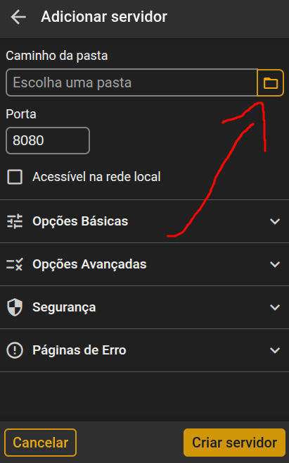

4. 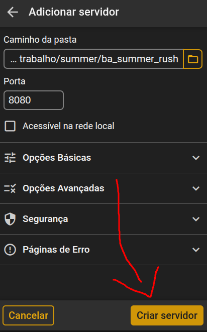

5. 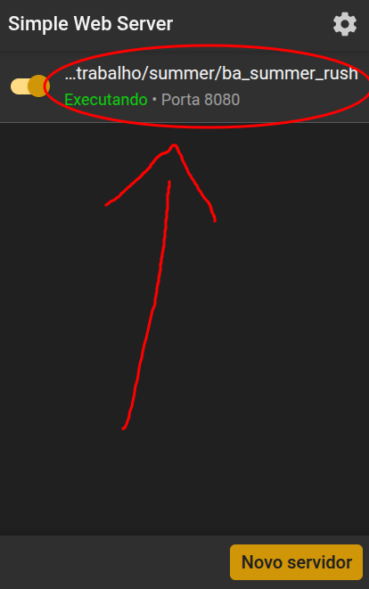

6. 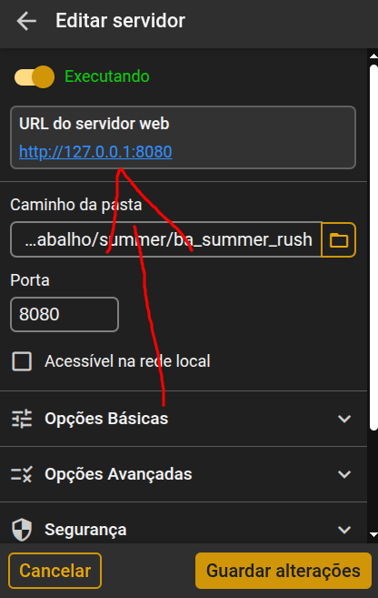

7. Aproveite!

# Android

> [!IMPORTANT]
> Antes de prosseguir, mude o idioma de conteúdo dos sites no navegador pra `Inglês (Estados Unidos)` em primeiro na lista
>   - [Chrome](https://support.google.com/chrome/answer/173424?hl=pt-BR&co=GENIE.Platform%3DAndroid&oco=1#zippy=%2Cadicionar-idiomas-preferidos%2Cadicionar-reorganizar-ou-remover-seus-idiomas-preferidos) (procure por `Adicionar, reorganizar ou remover seus idiomas preferidos`)
>   - [Firefox](https://support.mozilla.org/pt-BR/kb/mude-o-idioma-padrao-do-firefox-para-android)

1. Baixe o [Simple HTTP Server](https://play.google.com/store/apps/details?id=com.phlox.simpleserver)

2. Abra o Simple HTTP Server e permita o acesso a todos os arquivos

3. 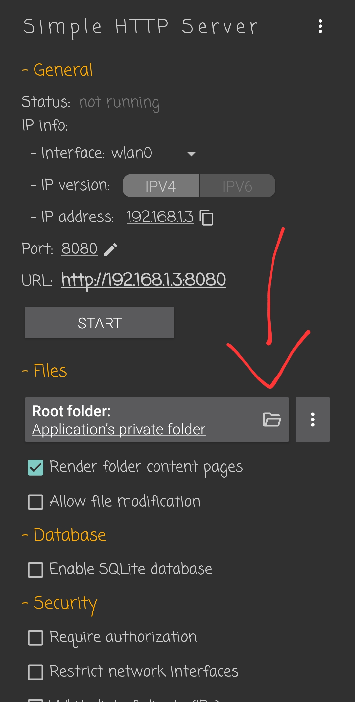

4. 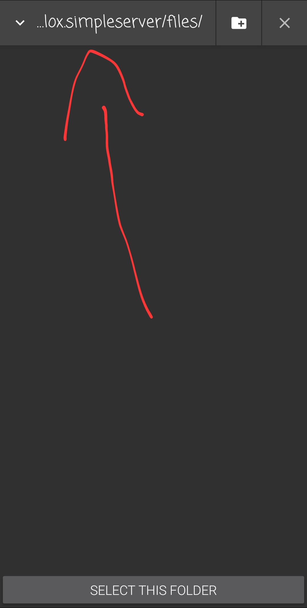

5. (Se você extraiu os arquivos do zip dentro da pasta de downloads)

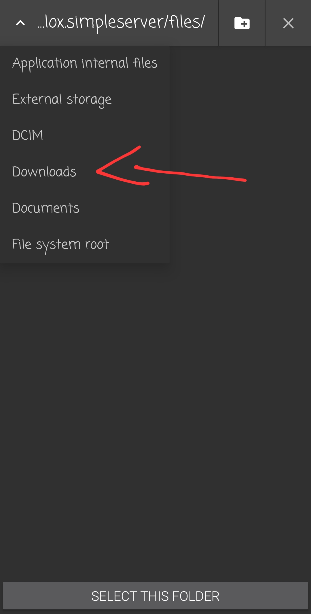

5. (Se você extraiu os arquivos em outro lugar)

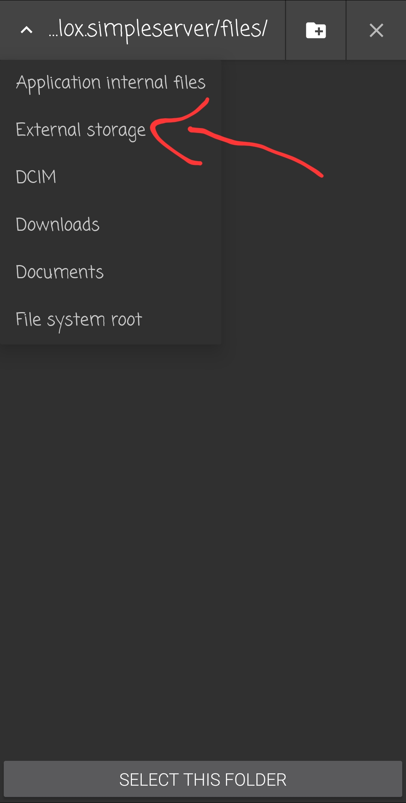

6. 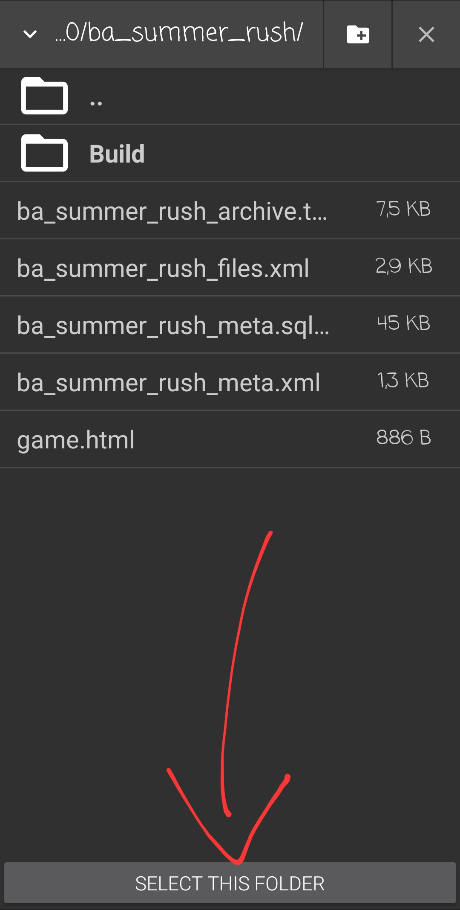

7. 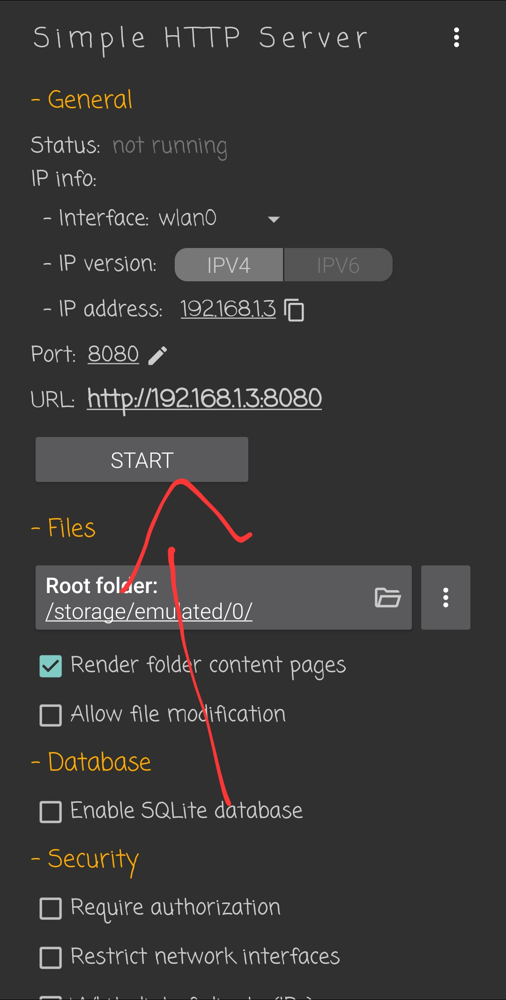

8. 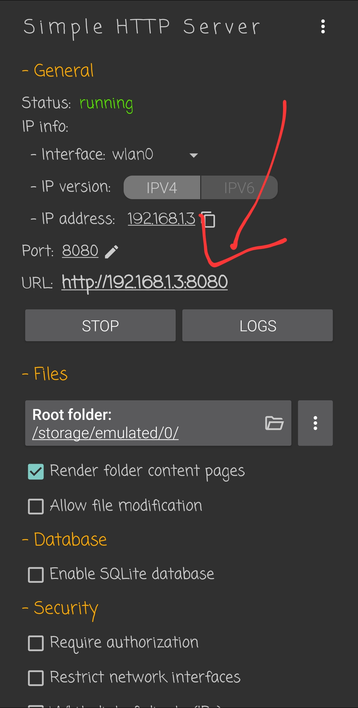

9. 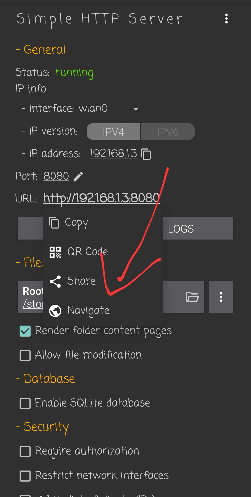

10. Aproveite!