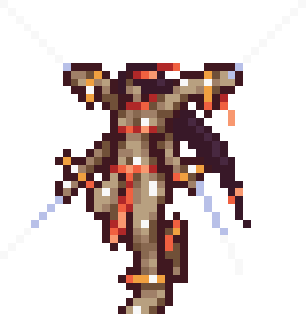
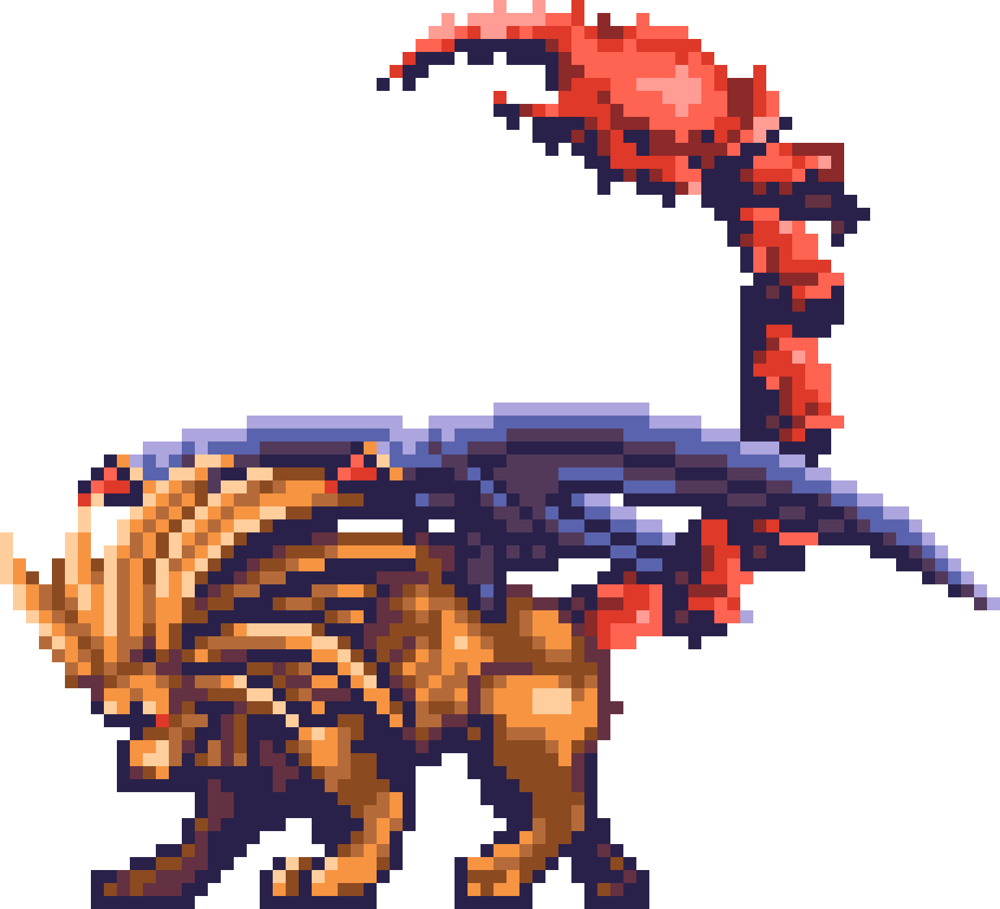
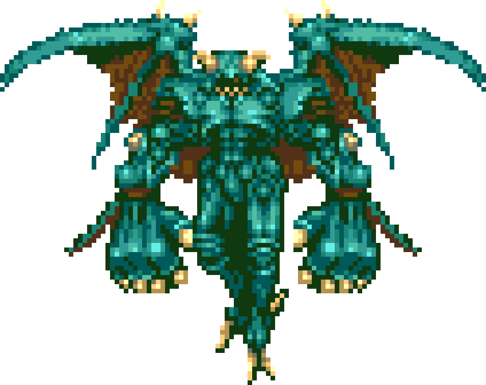
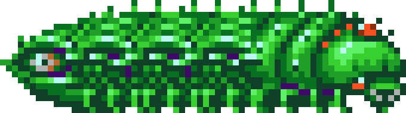
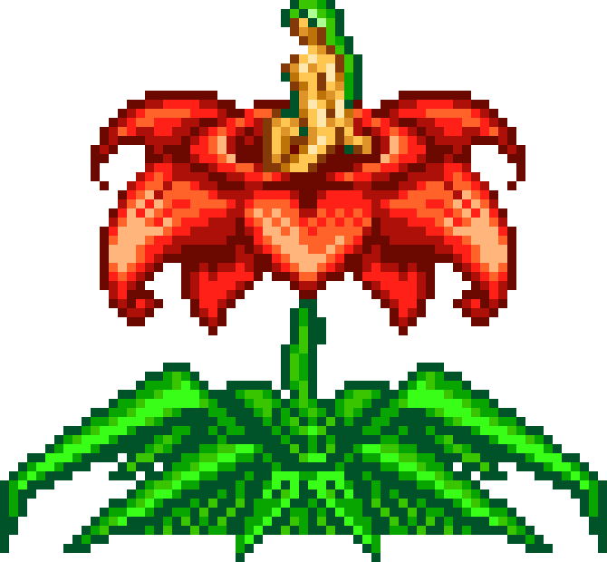
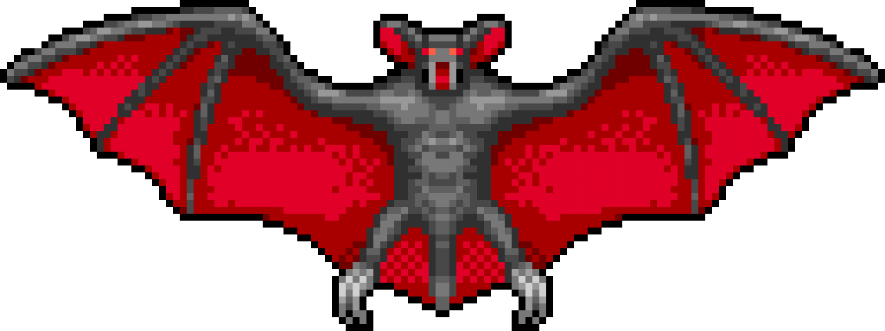
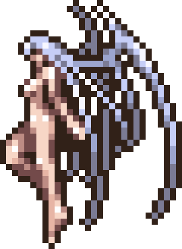
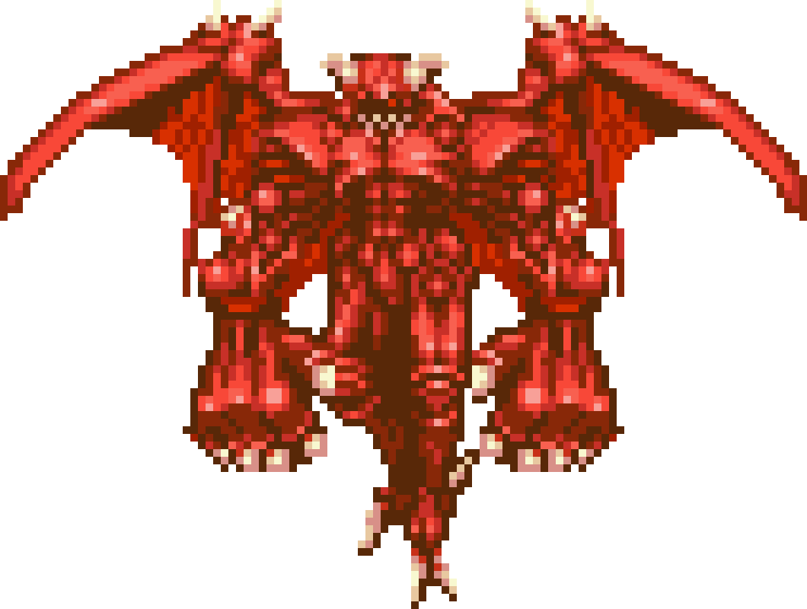

Dessa vez vai ser bem mais simples. Menos coisas, menos mistério.

# 1. Sinopse

É 2035, no Japão, quando várias pessoas se reúnem para observar o primeiro eclipse solar do século 21.

Uma dessas pessoas é Soma Cruz, um estudante comum de ensino médio de Hakuba-cho (Cidade de Hakuba).

Ele foi visitar o Santuário Hakuba junto com Mina Hakuba, sua amiga de infância e filha única da família que cuida desse santuário.

Acidentalmente, eles são transportados a um castelo estranho, onde encontram um homem misterioso, Genya Arikado que os informa vagamente sobre a situação.

Então, dá-se início a uma jornada para descobrir os mistérios por trás do castelo e do eclipse solar.

# 2. Informações básicas

Num geral, explicações rápidas sobre o que tem de novo ou diferente nesse jogo, se comparado a Symphony of the Night.

## 2.1 Interface

Tá bem mais simples agora.

- Número: vida atual
- Barra vermelha: vida atual, só que em relação ao máximo de vida
- Barra verde: Pontos de Magia (MP)

## 2.2 Almas

O poder especial do Soma é o de absorver almas de inimigos e usar elas como fonte de força.

Cada inimigo tem a sua própria alma que você pode pegar e usar.

Existem 4 tipos de almas:

1.  Almas Vermelhas: elas funcionam parecido com as arminhas de coração. `↑ + Ataque` pra usar. Gastam MP.
2.  Almas Azuis: elas mudam o que o botão `R` faz. Podem ser segurando `R` ou apertando `R` pra ativar. Gastam MP.
3.  Almas Amarelas: dão um boost de status. Não gastam MP.
4.  Almas Prateadas: os upgrades permanentes do jogo, similar às relíquias de Symphony.

## 2.3 Corações

Já que não tem arminhas de coração nesse jogo, os corações servem pra recarregar os MP.

Obs: MP também se recarregam com o tempo.

## 2.4 Portas azuis

Não, você não vai precisar da Jewel of Open de novo. Essas aí são as portas de sala de boss. Uma forma bem mais eficiente de dizer "procura um save, compra umas poções e se prepara".

## 2.5 Personagens

Esse jogo tem mais personagens que você pode encontrar e conversar. Alguns deles até ficam na entrada do castelo, então vá lá com frequência pra colocar os papos em dia e talvez até receber dicas.

## 2.6 Sorte

Por questões de <a href="https://castlevania.fandom.com/wiki/In-Game_Formula#Item_drop_rate_2" style="color:red">matemática</a> sua stat de sorte (Luck/LCK) é completamente irrelevante nesse jogo. Ignore ela.

Obs: alguns pouquíssimos itens dizem na descrição que dão efeitos especiais além do aumento de sorte. A parte de sorte continua irrelevante, mas o efeito especial funciona como esperado.

# 3. Progressão

Sinceramente, é um jogo bem polido, então imagino que seja possível progredir com naturalidade. Mas tem algumas poucas dicas in-game que eu acho insuficientes.

## 3.1 "Quero passar uma cachoeira, mas não consigo"

Pra passar na cachoeira impenetrável 🤨, você precisa de duas coisas:
- Alma Prateada - Undine
- Pelo menos uma dessas Almas Azuis de Rush

| Imagem | Nome | Local |
| :-: | :-: | :-: |
|  | Curly | Inner Quarters
|  | Manticore | Chapel  Floating Garden
|  | Devil | Floating Garden  Clock Tower |

Equipe as almas, se afaste um pouco da cachoeira, ande pra frente e faça o `R` de Rush (e continue segurando).

## 3.2 "Quero a armadura de curar"

Não tem... PORÉM, tem algo muito melhor.

| Imagem | Nome | Tipo | Local |
| :-: | :-: | :-: | :-: |
|  | Giant Worm |  | Underground Reservoir  Forbidden Area |
|  | Alura Une |  | Underground Cemetery  Forbidden Area |

## 3.2 "Quero a Crissaegrim"

Rapaz... não tem...

Mas se quiser encontrar algo similar, vá até um buraco dentro de um barco com peixes e fique batendo nas paredes igual maluco.

## 3.3 "Quero virar o Moggador Master"

Antes de entrar como um betinha na sala do trono (aquela, depois das escadas, que o Richter enfrenta o Drácula no começo de Symphony), consiga e equipe as seguintes almas:

| Imagem | Nome | Tipo | Local |
| :-: | :-: | :-: | :-: |
|  | Giant Bat |  | Recompensa de Boss |
|  | Succubus |  | The Arena  Top Floor |
|  | Flame Demon |  | Underground Cemetery  Forbidden Area |

Agora que você virou Chad e conseguiu o *poder de dominar* a arte do Mewing, pode prosseguir no caminho do farm de aura.

> Foto sua de agora
> 
> 